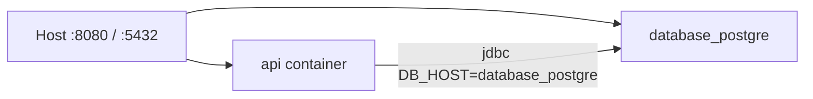

# Chạy API + PostgreSQL bằng Docker Compose

Một lệnh khởi động cả database và Spring Boot API (build JAR trong Docker qua multi-stage `Dockerfile`).

## Yêu cầu

- [Docker Desktop](https://www.docker.com/products/docker-desktop/) 4.x trở lên (Compose v2: `docker compose`)
- File `.env` tại thư mục gốc project (copy từ `.env.example`)

## Setup lần đầu

```bash
cp .env.example .env
```

Điền các giá trị thật trong `.env`:

- `DB_NAME`, `DB_USERNAME`, `DB_PASSWORD` — dùng cho container PostgreSQL
- `APP_JWT_SECRET` — tối thiểu 32 ký tự
- `MAIL_*` — SMTP thật (Gmail app password, v.v.)
- `CLOUDINARY_*` — nếu dùng upload ảnh
- Các biến `APP_REFRESH_TOKEN_*`, `APP_FORGOT_PASSWORD_*`
- **Admin seed (tùy chọn, chỉ dev):** `APP_ADMIN_SEED_ENABLED=true`, `APP_ADMIN_EMAIL`, `APP_ADMIN_PASSWORD` — tạo tài khoản admin khi API khởi động (xem `.env.example`)

**`DB_HOST` trong `.env`:** giữ `localhost` khi chạy API bằng IDE/`mvnw`. Docker Compose **tự ghi đè** `DB_HOST=database_postgre` cho service `api` — không cần sửa tay khi dùng compose.

**Tài khoản admin mặc định (khi bật seed):** `admin@sportpro.local` / `Admin@123456` — đăng nhập qua `POST /api/auth/login`, sau đó gọi các endpoint `/api/admin/*`.

## Chạy stack

```bash
docker compose up -d --build
```

Lần đầu build Maven trong image có thể mất vài phút.

Kiểm tra trạng thái:

```bash
docker compose ps
docker compose logs -f api
```

API: http://localhost:8080  
Swagger (nếu bật): http://localhost:8080/swagger-ui.html  
PostgreSQL từ máy host: `localhost:5432` (user/password theo `.env`)

## Lệnh thường dùng

| Mục đích | Lệnh |
|----------|------|
| Khởi động | `docker compose up -d --build` |
| Xem log API | `docker compose logs -f api` |
| Dừng | `docker compose down` |
| Xóa cả dữ liệu DB (volume) | `docker compose down -v` |
| Rebuild sau đổi code | `docker compose up -d --build` |

## Kiến trúc



- Service DB: `database_postgre` (image `postgres:16-alpine`)
- Service API: build từ `Dockerfile` (Maven build → JRE 21)
- CI production vẫn dùng `Dockerfile.runtime` + `deploy-vm.yml` — không đổi

## Troubleshooting

### Port 5432 already in use

Tắt PostgreSQL cài trên Windows hoặc đổi mapping trong `docker-compose.yml` (ví dụ `"5433:5432"`) và kết nối DBeaver qua port 5433.

### API crash-loop / Could not resolve placeholder

Thiếu biến trong `.env`. Đối chiếu với `.env.example` (đặc biệt `APP_REFRESH_TOKEN_*`, `APP_FORGOT_PASSWORD_*`).

### password authentication failed for user

Volume Postgres đã tạo với mật khẩu cũ. Reset:

```bash
docker compose down -v
docker compose up -d --build
```

### Connection refused tới database

```bash
docker compose ps
docker compose logs database_postgre
```

Đảm bảo `database_postgre` ở trạng thái `healthy` trước khi API start.

### Build chậm trên Windows

Bình thường với multi-stage Maven. Lần sau chỉ rebuild layer `src` khi đổi code.

### Không mount `.env` vào container

Chỉ dùng `env_file:` trong compose. Không volume-mount `.env` vào `/app` — tránh dotenv ghi đè `DB_HOST` về `localhost`.
